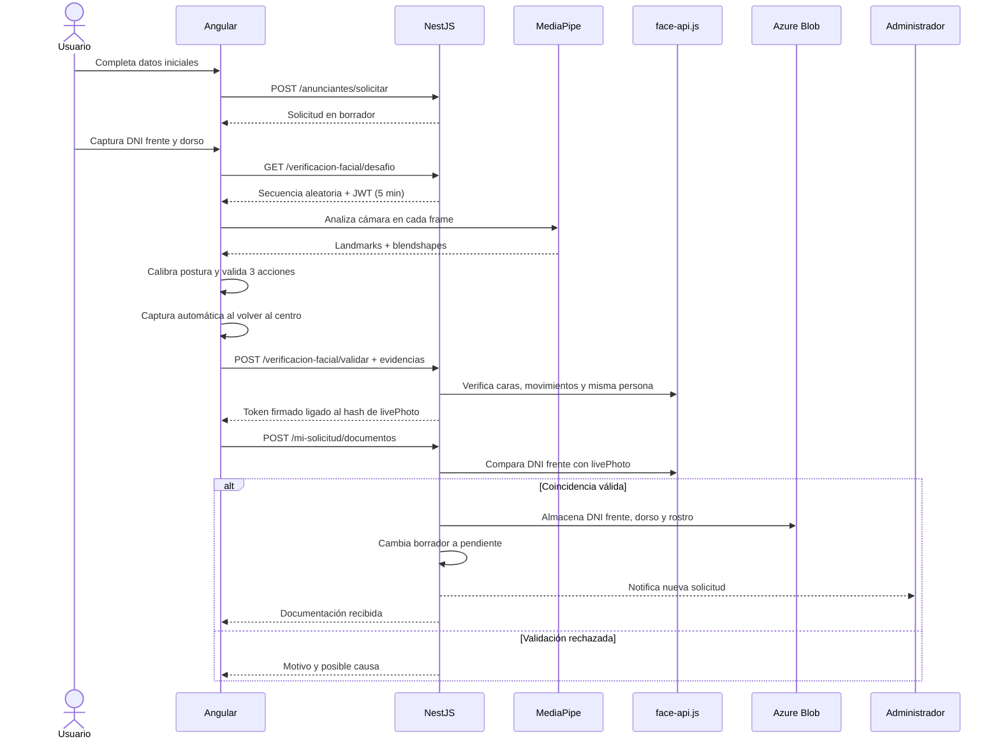

# Integración de verificación facial y prueba de vida

## 1. Objetivo de la modificación

Se integró al flujo existente de alta de anunciantes una verificación de identidad que combina:

- Captura obligatoria del frente del DNI desde la cámara.
- Captura obligatoria del dorso del DNI desde la cámara.
- Prueba de vida mediante movimientos faciales aleatorios.
- Captura automática del rostro cuando la persona vuelve a mirar al frente.
- Validación de la prueba de vida tanto en frontend como en backend.
- Comparación facial entre la fotografía del DNI y la captura en vivo.
- Envío de la documentación solamente si todas las verificaciones resultan válidas.

La integración se realizó dentro del módulo y la pantalla de solicitudes de anunciante que ya existían. No se creó un flujo alternativo de solicitudes ni se modificó el funcionamiento de publicaciones, reservas, autenticación o administración.

---

## 2. Problema que resuelve

Antes de este cambio, el usuario podía seleccionar desde su dispositivo tres archivos:

- `dni_frente`
- `dni_dorso`
- `rostro`

El archivo del rostro incluso podía ser una imagen o un video ya almacenado. Eso permitía enviar material precargado y no demostraba que la persona estuviera presente durante la solicitud.

El nuevo flujo elimina esos selectores de archivos y obliga a producir las tres fotografías desde `getUserMedia` y Canvas API durante la sesión actual. Además, el backend no confía solamente en que el frontend haya habilitado un botón: verifica las evidencias, firma una autorización temporal y vincula esa autorización con la fotografía facial exacta mediante SHA-256.

---

## 3. Flujo funcional completo

### 3.1. Datos iniciales

El primer paso continúa solicitando:

- Tipo de anunciante.
- CUIT/CUIL.
- Número de contacto.

El frontend utiliza el endpoint existente:

```http
POST /anunciantes/solicitar
```

La diferencia es que la solicitud se crea con estado `borrador`, no `pendiente`.

Esto es importante porque un registro `borrador`:

- Permite conservar la estructura actual de datos.
- Permite que el usuario continúe al paso de documentación.
- No aparece en el panel de solicitudes pendientes del administrador.
- Todavía no representa documentación lista para revisar.

El correo enviado en este punto también fue ajustado. Ahora indica que se guardaron los datos iniciales y que la solicitud llegará a revisión después de completar las capturas y la verificación facial.

### 3.2. Captura del frente del DNI

La aplicación solicita permiso para utilizar la cámara mediante:

```ts
navigator.mediaDevices.getUserMedia(...)
```

Para el DNI se solicita preferentemente la cámara trasera mediante `facingMode: environment`.

Sobre el video se dibuja un rectángulo con la proporción aproximada de una tarjeta. El usuario debe colocar el frente del DNI dentro de ese recuadro y presionar **Sacar foto del frente**.

La fotografía se obtiene así:

1. Se toma el frame actual del elemento `<video>`.
2. Se dibuja en un canvas oculto con `drawImage`.
3. El canvas se convierte a JPEG mediante `toBlob`.
4. El Blob se transforma en un `File` con fecha y nombre generados por la aplicación.
5. Ese mismo archivo se guarda en memoria y se muestra como vista previa.

No existe un `<input type="file">` en este flujo.

### 3.3. Captura del dorso del DNI

El proceso se repite para el dorso. El recuadro cambia su indicación a **DNI — DORSO** y la segunda fotografía queda almacenada en memoria.

Cuando el dorso queda capturado, el flujo cambia automáticamente a la prueba facial.

### 3.4. Preparación de la prueba de vida

El frontend realiza en paralelo tres operaciones:

1. Cambia preferentemente a la cámara frontal con `facingMode: user`.
2. Inicializa MediaPipe FaceLandmarker.
3. Solicita al backend un desafío aleatorio.

La imagen de la cámara frontal se muestra espejada para que izquierda y derecha resulten naturales para el usuario. El canvas de indicaciones no se espeja, por lo que los textos y flechas conservan su orientación correcta.

### 3.5. Generación del desafío

El frontend llama a:

```http
GET /anunciantes/verificacion-facial/desafio
Authorization: Bearer <token-de-sesión>
```

El backend mezcla aleatoriamente estas cuatro acciones:

- `TURN_LEFT`: girar la cabeza hacia la izquierda.
- `TURN_RIGHT`: girar la cabeza hacia la derecha.
- `TILT_HEAD`: inclinar la cabeza hacia un costado.
- `OPEN_MOUTH`: abrir la boca.

Luego elige tres acciones sin repetir.

La respuesta tiene esta forma:

```json
{
  "challengeToken": "jwt-firmado",
  "instructions": [
    { "type": "TURN_LEFT", "label": "Girá la cabeza hacia la izquierda" },
    { "type": "OPEN_MOUTH", "label": "Abrí la boca" },
    { "type": "TILT_HEAD", "label": "Incliná la cabeza hacia un costado" }
  ],
  "expiresInSeconds": 300
}
```

El `challengeToken` contiene:

- ID del usuario autenticado.
- Secuencia exacta de acciones.
- Identificador aleatorio `jti`.
- Alcance `face-liveness-challenge`.
- Vencimiento de cinco minutos.

La secuencia no puede modificarse desde el frontend sin invalidar la firma.

### 3.6. Calibración neutral

Antes de pedir movimientos, el usuario debe mirar al frente y mantener la cabeza quieta.

El frontend analiza 12 frames y calcula una postura neutral promedio. Esta referencia evita exigir el mismo ángulo absoluto a todas las personas y compensa pequeñas diferencias de posición de la cámara.

Durante esta etapa también se toma automáticamente una fotografía neutral. Esa imagen se utiliza posteriormente como referencia en el backend.

### 3.7. Validación de movimientos en el frontend

MediaPipe devuelve landmarks normalizados entre `0` y `1` y blendshapes asociados a expresiones faciales.

El frontend calcula:

- **Giro horizontal:** posición de la nariz respecto del centro y ancho de la cara.
- **Inclinación:** ángulo de la línea formada por los extremos de los ojos.
- **Apertura de boca:** blendshape `jawOpen`.

Aunque se utilizan los extremos de los ojos como puntos geométricos estables, no se analiza la dirección de la mirada ni se pide mover los ojos.

Cada acción debe mantenerse durante ocho frames consecutivos. Al completarse, el sistema toma automáticamente una fotografía de evidencia.

Los umbrales actuales del frontend son:

| Validación | Umbral |
|---|---:|
| Giro horizontal | `0.07` respecto de la postura neutral |
| Inclinación | `0.18` radianes respecto de la postura neutral |
| Apertura de boca | `jawOpen >= 0.45` |
| Frames consecutivos | `8` |
| Frames de calibración | `12` |

Estos valores son configuraciones del prototipo y pueden calibrarse con pruebas reales de usuarios y dispositivos.

### 3.8. Captura facial final

Al terminar los tres movimientos, la interfaz pide volver a mirar al frente.

Se exige que el giro y la inclinación vuelvan a estar cerca de la postura neutral durante ocho frames. Cuando esto ocurre:

- La fotografía se toma automáticamente.
- No se muestra ningún selector de archivo.
- La foto no contiene el óvalo, flechas ni textos, porque se captura desde el video limpio y no desde el canvas visible.

### 3.9. Revalidación de vitalidad en el backend

El frontend envía temporalmente las evidencias a:

```http
POST /anunciantes/verificacion-facial/validar
Content-Type: multipart/form-data
Authorization: Bearer <token-de-sesión>
```

Campos multipart:

| Campo | Contenido |
|---|---|
| `challengeToken` | JWT del desafío |
| `neutralPhoto` | Captura neutral |
| `action0` | Evidencia de la primera acción |
| `action1` | Evidencia de la segunda acción |
| `action2` | Evidencia de la tercera acción |
| `livePhoto` | Captura final centrada |

El backend realiza estas comprobaciones:

1. El token fue firmado por el servidor.
2. El token pertenece al usuario autenticado.
3. El token no superó los cinco minutos.
4. La secuencia contiene exactamente tres acciones.
5. Cada imagen puede decodificarse como JPG o PNG.
6. En cada imagen aparece exactamente una cara.
7. La persona es la misma en todas las evidencias.
8. Cada movimiento coincide con la secuencia firmada.
9. La captura final vuelve a estar centrada.

El backend no almacena estas evidencias intermedias. Solamente se utilizan para validar la prueba.

Si la prueba es válida, responde:

```json
{
  "valid": true,
  "verificationToken": "jwt-de-verificacion"
}
```

Este segundo token contiene:

- ID del usuario.
- Alcance `face-liveness-verified`.
- Hash SHA-256 de `livePhoto`.
- Identificador aleatorio.
- Vencimiento de cinco minutos.

La vinculación con el hash impide superar la prueba con una fotografía y luego reemplazarla por otro archivo al enviar la documentación.

### 3.10. Comparación contra el DNI y envío

Después de validar la vitalidad, el componente emite las tres fotografías y el token al componente existente de solicitud de anunciante.

El servicio existente llama automáticamente a uno de estos endpoints:

```http
POST /anunciantes/mi-solicitud/documentos
```

o, cuando se corrige una solicitud rechazada:

```http
POST /anunciantes/mi-solicitud/reenviar
```

Campos multipart:

| Campo | Contenido |
|---|---|
| `dni_frente` | JPEG capturado desde la cámara |
| `dni_dorso` | JPEG capturado desde la cámara |
| `rostro` | JPEG final de la prueba de vida |
| `verificationToken` | Autorización firmada por el backend |

Antes de almacenar cualquier archivo, el backend:

1. Comprueba que los tres archivos sean JPEG.
2. Comprueba el token de verificación.
3. Comprueba que el hash de `rostro` sea el mismo incluido en el token.
4. Extrae un descriptor facial del frente del DNI.
5. Extrae un descriptor facial de la captura en vivo.
6. Calcula la distancia euclidiana entre ambos descriptores.
7. Acepta la coincidencia si la distancia es menor o igual a `0.6`.

Solamente después de esas comprobaciones:

- Normaliza las imágenes a JPEG.
- Las almacena en Azure Blob Storage.
- Cambia el estado de `borrador` a `pendiente` o de `rechazada` a `reenviada`.
- Limpia el motivo anterior de rechazo.
- Actualiza la fecha de modificación.
- Notifica a los administradores.
- La solicitud aparece en el panel administrativo.

Si la comparación falla, no se almacena la documentación ni se envía la solicitud a revisión.

---

## 4. Diagrama de secuencia



---

## 5. Estados de la solicitud

Se agregó el estado `borrador` al enum `EstadoVerificacion`.

| Estado | Significado |
|---|---|
| `borrador` | Datos iniciales guardados; identidad todavía no validada |
| `pendiente` | Identidad validada y documentación enviada a revisión |
| `rechazada` | Administrador rechazó la solicitud con un motivo |
| `reenviada` | Usuario corrigió y reenvió la documentación |
| `aprobada` | Administrador aprobó la identidad y habilitó al anunciante |

Transiciones principales:

```text
sin solicitud -> borrador -> pendiente -> aprobada
                               |
                               v
                           rechazada -> reenviada -> aprobada/rechazada
```

El repositorio administrativo continúa consultando solamente `pendiente` y `reenviada`, por lo que los borradores no se muestran al equipo de revisión.

---

## 6. Tecnologías y responsabilidades

### MediaPipe FaceLandmarker

Se ejecuta en el navegador y se utiliza para obtener respuesta inmediata durante la experiencia de usuario:

- Detectar si hay una cara.
- Obtener landmarks normalizados.
- Calcular giro e inclinación.
- Leer `jawOpen`.
- Saber cuándo capturar las evidencias.

MediaPipe no determina si la cara coincide con el DNI.

### Canvas API

Se utilizan dos canvas con responsabilidades diferentes:

- **Canvas visible:** dibuja recuadros, óvalo, instrucciones y flechas.
- **Canvas oculto:** copia el frame limpio del video y lo convierte en JPEG.

Las indicaciones nunca quedan impresas en las fotografías enviadas.

### face-api.js y TensorFlow.js WASM

Se ejecutan en NestJS y se utilizan para:

- Detectar exactamente una cara por imagen.
- Obtener landmarks faciales del lado servidor.
- Generar descriptores de 128 valores.
- Comprobar que todas las evidencias pertenecen a la misma persona.
- Volver a comprobar los movimientos.
- Comparar el rostro en vivo contra el DNI.

El backend WASM evita depender de Canvas nativo o bindings gráficos del sistema operativo.

### JWT

Se reutiliza `JwtService`, que ya estaba disponible mediante `AuthModule`.

Hay dos tipos de token independientes:

- Token de desafío: contiene la secuencia aleatoria.
- Token de verificación: demuestra que el backend validó la prueba y contiene el hash de la captura final.

Ambos duran cinco minutos y están vinculados al usuario autenticado.

### SHA-256

El hash SHA-256 vincula el token de verificación con el contenido binario exacto de `livePhoto`. Si un cliente intenta enviar una imagen diferente, el hash cambia y el backend rechaza la solicitud.

---

## 7. Validaciones y mensajes de rechazo

El backend informa un motivo concreto y una posible causa en los escenarios principales:

| Situación | Respuesta orientativa |
|---|---|
| Cámara sin permiso | Se solicita habilitar el permiso del navegador |
| No aparece una cara | Posible poca luz, desenfoque o rostro fuera del recuadro |
| Aparece más de una cara | Debe aparecer una sola persona |
| Movimiento demasiado leve | Se pide repetirlo con mayor amplitud |
| Movimiento hacia el lado opuesto | Se informa que pudo realizarse hacia el lado contrario |
| Boca insuficientemente abierta | Se indica que la apertura no alcanzó el umbral |
| Persona diferente entre evidencias | Se informa que cambió la persona o que la iluminación impide reconocerla |
| Captura final inclinada | Se pide volver a mirar de frente |
| Desafío vencido | Se pide repetir la prueba por superar los cinco minutos |
| Archivo facial sustituido | Se informa que no es la captura validada |
| Rostro diferente al DNI | Se mencionan documento incorrecto, desenfoque, reflejos o poca luz |

Estos mensajes atraviesan el `errorInterceptor` existente y se muestran en la misma pantalla de solicitud.

---

## 8. Archivos agregados

### Frontend

- `front/src/app/features/solicitud-anunciante/captura-identidad/captura-identidad.component.ts`
- `front/src/app/features/solicitud-anunciante/captura-identidad/captura-identidad.component.html`
- `front/src/app/features/solicitud-anunciante/captura-identidad/captura-identidad.component.scss`
- `front/src/app/shared/services/verificacion-facial.service.ts`
- `front/public/assets/face_landmarker.task`

### Backend

- `back/src/anunciantes/service/verificacion-facial.service.ts`
- `back/src/models/face_landmark_68_model-weights_manifest.json`
- `back/src/models/face_landmark_68_model.bin`
- `back/src/models/face_recognition_model-weights_manifest.json`
- `back/src/models/face_recognition_model.bin`
- `back/src/models/ssd_mobilenetv1_model-weights_manifest.json`
- `back/src/models/ssd_mobilenetv1_model.bin`

---

## 9. Archivos modificados

### Frontend

#### `front/src/app/features/solicitud-anunciante/solicitud-anunciante.component.ts`

- Se retiró la administración manual de archivos.
- Se integró `CapturaIdentidadComponent`.
- Se conserva el formulario de datos y los estados existentes.
- La documentación se envía cuando el componente hijo emite una identidad validada.

#### `front/src/app/features/solicitud-anunciante/solicitud-anunciante.component.html`

- Se reemplazaron los tres inputs de archivos por el componente de captura.
- Se agregó una explicación del proceso.
- Se conserva la visualización de rechazos, revisión, aprobación e historial.

#### `front/src/app/core/services/perfil.service.ts`

- `DocumentosVerificacion` incluye `verificationToken`.
- El token se agrega al `FormData` de los endpoints existentes.

#### `front/src/app/shared/models/perfil.model.ts`

- Se agregó `borrador` a `EstadoVerificacion`.

#### `front/angular.json`

- Se agregó la copia de los archivos WASM de MediaPipe a `assets/wasm`.

#### `front/package.json` y `front/package-lock.json`

- Se agregó `@mediapipe/tasks-vision`.

#### `front/README.md`

- Se documentó brevemente el nuevo flujo.

### Backend

#### `back/src/anunciantes/controller/anunciantes.controller.ts`

- Se agregaron los endpoints de desafío y validación.
- Se agregó un interceptor multipart específico para las cinco evidencias.
- Los endpoints de documentos ahora reciben `verificationToken`.
- La documentación final acepta solamente JPEG capturado por el flujo.

#### `back/src/anunciantes/service/anunciantes.service.ts`

- La solicitud inicial queda como borrador.
- Se valida el token y el hash de la foto antes de subir archivos.
- Se compara la cara contra el DNI antes de persistir.
- Los archivos y notificaciones solamente se procesan si la comparación es válida.

#### `back/src/anunciantes/entity/solicitud-verificacion.entity.ts`

- Se agregó `BORRADOR` al enum.
- `BORRADOR` es el estado inicial por defecto.

#### `back/src/anunciantes/anunciantes.module.ts`

- Se registró `VerificacionFacialService` como provider.

#### `back/src/mail/mail.service.ts`

- El primer correo aclara que solo se guardaron los datos y que la solicitud todavía no fue enviada a revisión.

#### `back/nest-cli.json`

- Se configuró la copia de `src/models` hacia `dist/models` durante la compilación.

#### `back/package.json` y `back/package-lock.json`

- Se agregaron TensorFlow.js, backend WASM, face-api.js y decodificadores JPG/PNG.

#### `back/README.md`

- Se documentó brevemente la verificación.

### Archivos existentes no relacionados

Antes de comenzar la integración ya existía una modificación local en:

```text
back/src/usuarios/service/usuarios.service.ts
```

Esa modificación no forma parte de la verificación facial y fue preservada sin cambios durante este trabajo. También existía la carpeta local `.codex/`, que no forma parte de la funcionalidad.

---

## 10. Dependencias agregadas

### Frontend

```json
"@mediapipe/tasks-vision": "^1.0.1"
```

### Backend

```json
"@tensorflow/tfjs": "^4.22.0",
"@tensorflow/tfjs-backend-wasm": "^4.22.0",
"@vladmandic/face-api": "^1.7.15",
"jpeg-js": "^0.4.4",
"pngjs": "^7.0.0"
```

Dependencia de desarrollo:

```json
"@types/pngjs": "^6.0.5"
```

---

## 11. Modelos utilizados

### Frontend

```text
front/public/assets/face_landmarker.task
```

Se utiliza con MediaPipe FaceLandmarker. Los binarios WASM se copian automáticamente desde:

```text
front/node_modules/@mediapipe/tasks-vision/wasm
```

hacia:

```text
dist/front/browser/assets/wasm
```

### Backend

Los modelos de detección, landmarks y reconocimiento se encuentran en:

```text
back/src/models
```

Nest CLI los copia a:

```text
back/dist/models
```

`VerificacionFacialService` intenta primero cargar `dist/models` y utiliza `src/models` como alternativa durante desarrollo.

Fuentes de referencia:

- MediaPipe Face Landmarker: <https://developers.google.com/mediapipe/solutions/vision/face_landmarker/web_js>
- face-api.js utilizado mediante `@vladmandic/face-api`: <https://github.com/vladmandic/face-api>

---

## 12. Ejecución local

### Backend

```bash
cd back
npm install
npm run start:dev
```

El backend conserva sus variables existentes:

- `DATABASE_URL`
- `JWT_SECRET`
- `AZURE_STORAGE_CONNECTION_STRING`
- `AZURE_VERIFICACION_CONTAINER`
- Variables del servicio de correo.

No se agregaron nuevas variables obligatorias.

### Frontend

```bash
cd front
npm install
npm start
```

La cámara del navegador requiere un contexto seguro:

- `http://localhost` funciona durante desarrollo.
- En un dominio remoto debe utilizarse HTTPS.

---

## 13. Compilación y pruebas realizadas

Se ejecutaron correctamente:

```bash
cd back
npm run build
npm run lint
npm test -- --runInBand
```

Resultado:

- Compilación del backend aprobada.
- Prueba existente del backend aprobada.
- Análisis estático sin errores.
- Existen dos advertencias previas en `usuarios.service.ts`, archivo que ya estaba modificado antes de esta integración.

También se ejecutaron:

```bash
cd front
npm run build
npm test -- --watch=false
```

Resultado:

- Compilación del frontend aprobada.
- Dos archivos de pruebas aprobados.
- Cinco pruebas aprobadas.
- Angular informa una advertencia de presupuesto: el bundle inicial supera el límite de 500 kB por aproximadamente 55 kB. No impide compilar ni ejecutar.

Además, se inició el backend completo y se comprobó:

- Conexión e inicialización normal de NestJS.
- Registro correcto de los dos endpoints nuevos.
- Inicialización de TensorFlow.js WASM.
- Carga correcta de todos los modelos desde `back/dist/models`.

---

## 14. Checklist de prueba manual

### Caso exitoso

1. Iniciar sesión con un usuario no anunciante.
2. Entrar a **Mi perfil > Convertite en anunciante**.
3. Completar tipo, CUIT/CUIL y contacto.
4. Confirmar que el paso cambia a documentación.
5. Dar permiso de cámara.
6. Capturar el frente del DNI dentro del recuadro.
7. Capturar el dorso.
8. Mirar de frente durante la calibración.
9. Realizar las tres instrucciones aleatorias.
10. Volver a mirar de frente.
11. Confirmar que la captura facial es automática.
12. Esperar la comparación y el envío automático.
13. Confirmar que el estado cambia a revisión.
14. Entrar con administrador y verificar que la solicitud aparezca con las tres imágenes.

### Casos de rechazo recomendados

- Negar permiso de cámara.
- Sacar el DNI desenfocado.
- Mostrar un DNI sin una cara detectable.
- Hacer un movimiento demasiado leve.
- Girar hacia el lado opuesto.
- Permitir que aparezcan dos personas.
- Cambiar de persona durante la secuencia.
- Permanecer inclinado al momento de la captura final.
- Utilizar el DNI de otra persona.
- Dejar vencer el desafío durante más de cinco minutos.

En todos esos casos se debe mostrar un mensaje y la solicitud no debe pasar a `pendiente`.

---

## 15. Consideraciones de despliegue

### HTTPS

`getUserMedia` requiere HTTPS fuera de localhost. El dominio del frontend debe tener un certificado válido.

### Tamaño de modelos

Los modelos del backend suman varios megabytes y deben incluirse en el artefacto de despliegue. La configuración de `nest-cli.json` se encarga de copiarlos al compilar.

### Memoria y arranque

TensorFlow y los modelos se cargan una sola vez mediante `OnModuleInit`. Esto evita recargar aproximadamente los mismos recursos en cada request, pero aumenta el tiempo y memoria iniciales del proceso.

### Backend con múltiples instancias

Los tokens de desafío y verificación son JWT firmados y no dependen de memoria local. Por lo tanto, pueden emitirse en una instancia y verificarse en otra, siempre que compartan el mismo `JWT_SECRET`.

### Sin migración manual en el entorno actual

La configuración actual utiliza:

```ts
synchronize: true
```

TypeORM intentará incorporar el valor `borrador` al enum al iniciar el backend. Para un entorno productivo se recomienda desactivar `synchronize` y crear una migración explícita para el nuevo valor.

---

## 16. Seguridad y limitaciones conocidas

### Controles incorporados

- No hay selectores de archivos en la experiencia normal.
- Las fotografías se crean desde el frame actual del video.
- El desafío es aleatorio, firmado y breve.
- El backend vuelve a comprobar los movimientos.
- Se exige una sola cara.
- Se compara que sea la misma persona durante toda la prueba.
- La captura final debe estar centrada.
- El token queda ligado al hash de la captura final.
- El rostro final se compara contra el DNI.
- No se persiste nada antes de superar todos los controles.

### Límites

Esta solución reduce significativamente el uso de archivos precargados desde la interfaz y dificulta la sustitución de imágenes, pero no debe considerarse una solución biométrica certificada.

Un atacante avanzado todavía podría intentar utilizar:

- Una cámara virtual.
- Deepfakes en tiempo real.
- Instrumentación del navegador.
- Reproducción sofisticada sincronizada con el desafío.

Para un entorno de alta seguridad se debería evaluar un proveedor especializado en liveness activo/pasivo, detección de profundidad, análisis de textura, device attestation y auditoría biométrica.

### Privacidad

Las imágenes faciales y del DNI son datos sensibles. El proyecto ya utiliza un contenedor privado de Azure y URLs firmadas temporales para administración. Se recomienda complementar esto con:

- Política de retención y eliminación.
- Registro de accesos administrativos.
- Consentimiento informado.
- Cifrado y rotación de secretos.
- Revisión de normativa aplicable de protección de datos.

---

## 17. Puntos de calibración futura

Los valores que probablemente requieran ajustes después de pruebas con usuarios son:

- Umbral de comparación facial `0.6`.
- Giro de cabeza del frontend `0.07`.
- Giro de cabeza del backend `0.06`.
- Inclinación del frontend `0.18` radianes.
- Inclinación del backend `0.15` radianes.
- Apertura de boca del frontend `jawOpen >= 0.45`.
- Apertura relativa de boca del backend.
- Cantidad de frames consecutivos.
- Tolerancia para considerar la cara centrada.
- Calidad JPEG `0.92`.

Los umbrales del backend son levemente más tolerantes que los del frontend. Esto evita que una acción aceptada visualmente sea rechazada por pequeñas diferencias entre los landmarks de MediaPipe y face-api.js.

---

## 18. Resumen para presentar al equipo

La solicitud ahora tiene una etapa de borrador y solamente llega a revisión cuando la identidad supera una verificación completa. El usuario no adjunta archivos: fotografía ambas caras del DNI, completa tres acciones aleatorias y la aplicación toma automáticamente una captura centrada. MediaPipe proporciona respuesta en tiempo real, mientras que NestJS vuelve a validar las evidencias, firma la captura aceptada y compara su descriptor facial contra el DNI. Si algo falla, no se almacena documentación y se informa una causa probable. Si todo coincide, se reutiliza el flujo existente de Azure, revisión administrativa, rechazo, reenvío y aprobación.
